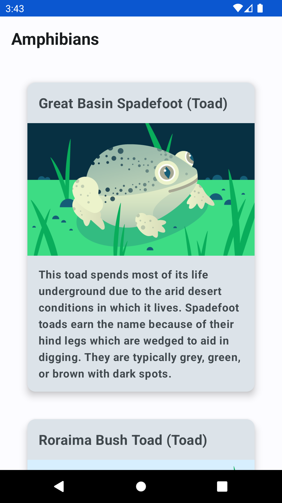

Amphibians App
==================================

An app to display a list of amphibians, along with their details and image. 
The data is retrieved from the internet by making a network request and contains each amphibian's name, type, description, and image URL.

- Architecture MVVM
- Jetpack Compose
- Retrofit
- Clean code

